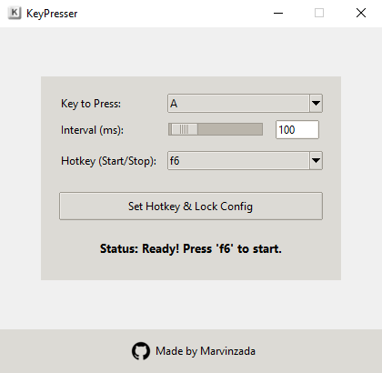

A GUI application for automating keyboard presses, built with Python and Tkinter.



---

## How to Compile

Follow these steps to create the `.exe` file yourself.

### 1. Prerequisites

- [Python 3.x](https://www.python.org/downloads/) installed.
- [Git](https://git-scm.com/downloads/) installed.

### 2. Setup

First, clone the repository to your local machine.

```bash
git clone https://github.com/Marvinzada/KeyPresser.git
cd KeyPresser
```

### 3. Install Dependencies
This project requires a few Python libraries. Install them easily using the requirements.txt file.

```bash
pip install -r requirements.txt
```

### 4. Create the .exe File
To compile the application into a single executable file, run the following command in your terminal.

```bash
pyinstaller --onefile --windowed --name KeyPresser --icon=icon.ico --add-data "github_logo.png;." --add-data "icon.ico;." kpresser.py
```

### 5. Run the Application
The final KeyPresser.exe will be located in the dist folder.


### License
This project is licensed under the MIT License.
